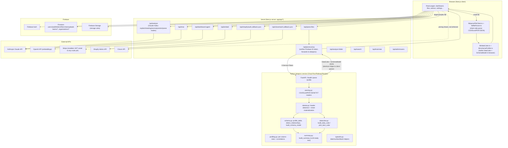

# DashWise — Full Application Architecture & Roadmap

_Last generated: 2026-07-02. This is a snapshot based on reading the code directly — re-verify
function names/routes against the source before relying on this for anything load-bearing, since
the app will keep changing._

## 1. What DashWise Is

DashWise is a SaaS web app that lets a business owner upload raw business data (CSV, Excel, PDF,
JSON, POS exports) and instantly get an interactive dashboard plus an AI "advisor" that explains
what's happening in plain English, flags anomalies, and recommends actions. Pitch on the landing
page: **"Power BI feel, zero setup."** Target buyer is a non-technical small/medium business owner
(retail, restaurant, ecommerce, service, clinic, salon — see the `businessType` contexts baked into
the AI prompt), with a Team/Business tier aimed at multi-location or franchise operators who need
shared workspaces, SSO, and admin controls.

Stack:
- **Frontend + app backend**: Next.js 16 (App Router) + React 19 + TypeScript, deployed on Vercel.
- **Auth/data**: Firebase Auth, Firestore (NoSQL, no SQL migrations — see `firestore.rules`),
  Firebase Storage.
- **AI**: Anthropic Claude SDK (`@anthropic-ai/sdk`) is what's actually wired into the `/analyze`
  route today (`claude-haiku-4-5`); OpenAI SDK is also a dependency (used for embeddings/RAG —
  see §5, `lib/rag/`).
- **Billing**: Stripe SDKs (`stripe`, `@stripe/stripe-js`) are installed but **no checkout/webhook
  API route exists** — see §6.
- **Integrations**: Shopify and Clover POS, OAuth-based sync.
- **Enterprise**: SSO stub for Google Workspace/Azure AD (`lib/enterprise/sso.ts`).
- **Heavy-file microservice**: a separate Python FastAPI service (`services/dataproc/`) for files
  too large/complex for the browser to parse (500k+ row CSVs, multi-sheet Excel, PDFs). Deployed
  independently (Cloud Run/Railway/Render) because Vercel can't run long/heavy Python.

Repo note: `dashwise-v1` (the outer folder) is essentially empty — the real project is the nested
`dashwise/` folder, which has its own git repo.

---

## 2. Architecture Diagram

---

## 3. End-to-End Data Flow

### 3.1 File upload → dashboard (the core loop)
1. User drops a file on `/files` or `/dashboard`.
2. **Routing decision** (client-side, by file size/complexity): small/simple files are parsed
   entirely in the browser via `lib/parseFileClient.ts` / `lib/fileParser.ts`; large or complex
   files (currently gated at an **8MB routing threshold**) are sent to `/api/parse-files`, which
   proxies to `/api/parse-proxy`.
3. `/api/parse-proxy` (`app/api/parse-proxy/route.ts`) verifies the caller's Firebase ID token via
   the Identity Toolkit REST API, then forwards the multipart file to the Python service's
   `POST /parse` with an `X-Service-Token` shared secret. If `DATAPROC_URL` isn't configured, it
   returns `503 {fallback: true}` and the client silently falls back to browser parsing.
4. On the Python side (`services/dataproc/app/main.py::parse`):
   - Dispatches by extension to `parsing.py` (`read_csv`, `read_excel`, `read_pdf`, `read_json`,
     `read_txt`) → each returns an array-of-arrays (AoA).
   - `tabular.py::materialize_sheet` finds the real header row (`detect_header_row`, scored by
     string-density/uniqueness heuristics) and drops "Total/Subtotal/Summary" rows
     (`is_summary_row`).
   - `schema.py::build_schema_model` profiles every column (`profile_column`: null%, type,
     role — key/measure/dimension/date/text — and data-quality flags), classifies each sheet's
     role (`profile_table`: fact/dimension/bridge/flat/reference), infers foreign-key joins across
     sheets by value-set overlap (`detect_relationships`), and classifies the overall shape
     (`determine_shape`: star/snowflake/flat/single-table/multi-fact/disconnected).
   - `datacube.py::pick_best_cube` → `build_data_cube` auto-picks a date column, up to 4
     dimension columns, and up to 8 numeric measure columns, then aggregates every row into a
     compact week-grain (or month-grain if the cube would exceed 50,000 rows) cube — so a
     multi-million-row file still returns a dashboard-sized payload.
   - `summary.py::build_summary` renders the schema + cube into a compact, importance-ranked
     plain-text description (fact tables first, then dimensions), truncated to a 60k-character
     budget — this is what later gets fed to the LLM as context instead of raw rows.
   - The whole thing returns as one JSON object: `{content, sheets, rowCount, fileType, fileName,
     chars, truncated, cube, schema}` — **the exact same shape** the browser's own
     `dataCube.ts`/`schemaProfiler.ts` would produce, so downstream code never needs to know which
     engine ran.
5. The resulting `DataCube` + `SchemaModel` are stored under the user's Firestore
   `users/{uid}/folders/{folderId}/files/{fileId}` document and rendered by
   `components/AnalysisDashboard.tsx`.
6. When the user asks a question or requests an explanation, the app sends the cube/summary
   `content` (not raw data) to `/api/analyze` (or `/api/chat`, `/api/dashboard-agent`), which calls
   Claude with a mode-specific system prompt (`explain`, `meeting`, `anomaly`, `action`, `parse`)
   plus a business-type context block (retail/restaurant/ecommerce/service/clinic/salon), and
   returns plain-English text (or structured JSON for `parse` mode) to the UI.

### 3.2 POS integrations (Shopify / Clover)
`/api/shopify/auth` → OAuth redirect → `/api/shopify/callback` stores the access token →
`/api/shopify/sync` pulls orders/products and feeds them through the **same** tabular →
schema → cube → summary pipeline as an uploaded file, so POS data lands in the same dashboard
shape. Clover follows the identical auth/callback/sync pattern.

### 3.3 Auth / access control
Firebase Auth handles login/signup/SSO (`app/login`, `app/signup`, `app/enterprise-login`,
`app/reset-password`). `firestore.rules` enforces: a user can only read/write their own
`users/{uid}` subtree; team members can read (but not write) shared `teams/{teamId}` data, only a
`role: admin` member can write; the same owner/member/admin pattern repeats for
`organisations/{orgId}` (the Business/Enterprise tier — adds `settings` and `kpiGlossary`
sub-collections for org-wide KPI definitions).

---

## 4. Python Service Function Reference (`services/dataproc/app/`)

All of this is a Python port of specific TypeScript files in `lib/` — kept **line-by-line
equivalent on purpose** so a file parsed in-browser vs. server-side produces byte-identical
`DataCube`/`SchemaModel` JSON. If you change the TS version, mirror the change here (and vice
versa) or the two engines will silently diverge.

| File | Ports | Key functions | Role |
|---|---|---|---|
| `main.py` | — (FastAPI wrapper) | `health()`, `parse()`, `profile()`, `assemble_tabular()`, `require_token()` | Entry point. `require_token` gates every non-health route behind the `X-Service-Token` header (skipped if `SERVICE_TOKEN` env is unset — local-dev only). `parse()` dispatches by file extension. `assemble_tabular()` wires materialize → schema → cube → summary → truncation into the final response shape. |
| `parsing.py` | new (no direct TS equivalent; browser uses different libs) | `read_csv`, `read_excel`, `read_pdf`, `read_json`, `read_txt`, `records_to_aoa`, `sniff_delimiter` | Turns raw bytes into an array-of-arrays. Uses pandas for CSV/TXT, openpyxl for Excel (fills merged cells from their anchor, skips hidden sheets, caps at 20 sheets), pdfplumber for PDF (extracts text + best table, flags scanned/image-only PDFs when <20 meaningful characters extracted), and a wrap-key heuristic (`data`/`results`/`records`/`rows`/`items`) to find the tabular array inside arbitrary JSON. |
| `tabular.py` | `lib/parseFileClient.ts` | `detect_header_row()`, `is_summary_row()`, `materialize_sheet()` | Scores the first 15 rows to find the real header (string density + uniqueness − numeric penalty), then drops rows containing summary keywords (total/sum/grand/subtotal/average/count) or that are mostly blank. |
| `typeutils.py` | `lib/dataCube.ts` (shared helpers) | `parse_date_value()`, `is_numeric_value()`, `to_number()`, `is_blank()`, `week_start_iso()`, `month_start_iso()`, `month_key()` | Value classification used everywhere else. `parse_date_value` handles native dates, Excel serial numbers (25569–80000 range), `yyyymmdd` integer keys, and ISO/common date strings via `dateutil`. |
| `datacube.py` | `lib/dataCube.ts` | `build_data_cube()`, `pick_best_cube()`, `_pick_date_column()`, `_pick_dimensions()`, `_pick_measures()` | The auto-dashboard engine. Picks the best date column by date-match %, up to 4 dimensions (favoring columns matching a regex of business-y names like territory/region/channel/category, cardinality 2–50), and up to 8 numeric measures (excluding IDs and near-unique integer columns). Aggregates every row into a week-grain cube keyed by `week|month|dim-values`, capping at 50,000 cube rows before falling back to month grain. `pick_best_cube` tries every sheet, largest first, and returns the first one that yields a valid cube. |
| `schema.py` | `lib/schemaProfiler.ts` | `profile_column()`, `profile_table()`, `detect_relationships()`, `determine_shape()`, `build_schema_model()` | The data-quality/relationship engine. `profile_column` classifies dtype (date/boolean/integer/decimal/mixed/text) and role (key/measure/dimension/date/flag/text), and raises quality flags (high null%, mixed types, negative measures, case/spacing duplicates, constant columns). `profile_table` classifies each sheet as fact/dimension/bridge/flat/reference by key-count + measure-count + row-count heuristics. `detect_relationships` infers joins between sheets by sampling key-column value sets and checking ≥60% overlap, classifying cardinality (one-to-one/one-to-many/many-to-one/many-to-many). `determine_shape` labels the overall dataset (single-table/star/snowflake/multi-fact/flat/disconnected). |
| `profiling.py` | new (deeper than schema.py, powers `/profile` only) | `profile_dataframe()`, `pd_to_numeric()` | Per-column stats using pandas: null%, distinct count, and for numeric columns mean/median/std/quartiles/3-sigma outlier count; for categorical columns top-10 value counts. Also computes pairwise Pearson correlations (|r| ≥ 0.5) across numeric columns to surface potential drivers. |
| `summary.py` | new equivalent of a TS `buildSmartSummary` | `build_summary()`, `_fmt()` | Renders the schema model into a compact, importance-ranked (fact tables first) plain-text block for the LLM: per-table grain description, per-column role/type/quality flags, and a relationships section — capped at a 60k-character budget with truncation markers. |
| `__init__.py` | — | — | Empty; marks `app` as a package. |

`services/dataproc/requirements.txt`: fastapi, uvicorn, python-multipart, pandas, openpyxl,
pdfplumber, python-dateutil, duckdb, pyarrow. Note `duckdb`/`pyarrow` are installed but **not yet
used anywhere in the current code** — they're pre-staged for the Phase 3 roadmap (§6).

---

## 5. Frontend / API Surface Map

**Pages** (`app/*/page.tsx`): `/` landing+pricing, `/login`, `/signup`, `/enterprise-login`,
`/reset-password`, `/onboarding`, `/dashboard`, `/dashboard-view`, `/overview`, `/files`,
`/history`, `/advisor` (AI chat), `/settings`, `/integrations`, `/admin`.

**API routes** (`app/api/*/route.ts`):

| Route | Purpose |
|---|---|
| `analyze` | Claude Haiku call for explain/meeting/anomaly/action/parse modes (see §3.1 step 6). |
| `analyze-folder` | Same idea scoped to a whole folder of files rather than one file. |
| `chat` | Conversational AI advisor endpoint (backs `/advisor`). |
| `dashboard-agent` | Likely an agentic endpoint that can act on/modify dashboard state via AI — check this file directly before building on it. |
| `embed` | Generates embeddings (OpenAI) for `lib/rag/embeddings.ts` / `lib/rag/vectorStore.ts` — retrieval-augmented context for chat/search. |
| `search` | Search over embedded content. |
| `parse-files` | Client entry point that decides browser-vs-service routing and calls `parse-proxy` when needed. |
| `parse-proxy` | Thin authenticated proxy to the Python dataproc service (see §3.1 step 3). |
| `train/rate` | Backs `lib/training/fineTuning.ts` — presumably thumbs up/down feedback capture on AI outputs. |
| `clover/auth`, `clover/callback`, `clover/sync` | Clover POS OAuth + data sync. |
| `shopify/auth`, `shopify/callback`, `shopify/sync` | Shopify OAuth + data sync. |
| `admin/users` | Admin user management (scope/RBAC not yet verified — see §6). |
| `portfolio` | Purpose not yet inspected — verify before extending. |
| `dev-guide` | Purpose not yet inspected — verify before extending. |

**Core client lib** (`lib/`): `firebase.ts`/`AuthContext.tsx`/`db.ts` (Firebase plumbing),
`fileParser.ts`/`parseFileClient.ts` (browser parsing engine — the TS twin of the Python
`parsing.py`/`tabular.py`), `dataCube.ts`/`schemaProfiler.ts`/`kpiSummary.ts` (the original TS
cube/schema/summary logic the Python service ports), `styles.ts`, `enterprise/sso.ts`,
`integrations/clover.ts` + `integrations/shopify.ts`, `rag/embeddings.ts` + `rag/vectorStore.ts`,
`training/fineTuning.ts`.

**Test scripts** (`scripts/`): `testCube.ts`, `testJoins.ts`, `testSummary.ts` — standalone,
not wired into `package.json` scripts currently (run manually via `ts-node` or similar).

---

## 6. Known Gaps / Risks (observed directly in code, not speculation)

1. **Large-file production path is broken by design, and documented as such** (`SETUP.md`):
   Vercel caps request bodies at ~4.5MB, but the routing threshold that decides "send this to the
   Python service" is 8MB. Anything in that gap can never actually reach the service in
   production — it silently falls back to the browser parser, which defeats the stated "500k+
   row" capability. The documented fix (browser → Firebase Storage → signed URL → service) is
   **not implemented**; `storage.rules` exists but nothing uploads through it yet.
2. **Billing is not enforced anywhere.** `stripe` and `@stripe/stripe-js` are installed
   dependencies, the landing page advertises 4 paid tiers (Free/$0, Pro/$29, Team/$199,
   Business/$799) with feature lists (seats, SSO, KPI glossary, admin controls), but there is
   **no Stripe checkout route, no webhook handler, and no plan-gating logic** anywhere in
   `app/api/*` or `firestore.rules`. Nothing currently stops a Free user from using Pro/Team/
   Business features (e.g. "5 analyses/month" isn't metered anywhere found).
3. **Phase 3 (the AI-computes-over-full-data roadmap) is explicitly not built**
   (`services/dataproc/README.md`): planned `POST /ingest` + `POST /query` using LlamaIndex + a
   vector DB (pgvector/Qdrant) + DuckDB for true NL→SQL over full datasets. Today the AI only ever
   sees the compact text `summary` + aggregated cube, not the full dataset — fine for "explain my
   dashboard," not enough for "what were my exact refunds in March across all 40 stores."
   `duckdb`/`pyarrow` are already in `requirements.txt`, pre-staged for this.
4. **Multi-sheet join enrichment is detected but not applied.** `schema.py::detect_relationships`
   finds joins between sheets, but nothing currently uses that to actually enrich fact rows with
   dimension attributes (`buildJoinLookups`/`enrichFactRows`, per the dataproc README roadmap) —
   so a multi-sheet upload with real relational structure doesn't get the benefit in the cube/AI
   context today.
5. **Unverified areas** (not inspected in this pass — check before building on them):
   `app/api/dashboard-agent`, `app/api/portfolio`, `app/api/dev-guide`, `app/api/admin/users`
   (does it actually enforce admin-only access server-side, or only rely on Firestore rules?),
   and whether `/api/train/rate` feedback is used anywhere to actually fine-tune or adjust
   behavior, or just logged.
6. A stray, unrelated file lives in the repo root: `"# Power BI Auto-Save GUI Application.txt"`
   (a PowerShell UI-automation script) — not part of the app, safe to remove if it's just clutter.

---

## 7. Path to Profitability — Prioritized Product/Feature Gaps

Ranked by "blocks revenue or retention today" first:

1. **Wire up billing (highest priority — you cannot charge money right now).**
   Add a real checkout flow (`/api/billing/checkout` using `stripe.checkout.sessions.create`),
   a webhook handler (`/api/billing/webhook`) to sync subscription status into Firestore
   (`users/{uid}.plan`, `.analysesUsedThisMonth`, etc.), and server-side plan gating on
   `/api/analyze` and friends (reject/soft-limit when a Free user exceeds "5 analyses/month").
   Without this, every pricing tier on the landing page is aspirational copy.
2. **Fix the large-file gap for real** — implement the documented
   browser → Firebase Storage (signed URL) → dataproc `/parse` path. This is the single feature
   most directly tied to the Pro/Team/Business pitch ("500k+ row files," "zero setup at scale");
   right now it silently degrades for exactly the files that would prove the product's value to a
   paying customer with real data.
3. **Make the AI advisor compute over full data, not just a summary** (Phase 3: `/ingest` +
   `/query`). This is the most likely durable differentiator vs. "just export to Excel/Power BI" —
   today's summary-based advisor gives good plain-English narration but can't answer precise
   ad-hoc questions, which is exactly what a paying "advisor" product needs to be worth $29–799/mo.
4. **Meter and surface usage** — even a simple "3 of 5 analyses used this month" indicator on
   `/dashboard` drives upgrade conversion and requires the same usage-counter work as #1.
5. **Harden onboarding/activation** — first-upload experience (`/onboarding`), sample data for
   users without a file ready, and a clear "here's your first insight" moment, since that moment
   decides whether a Free signup ever becomes a Pro conversion.
6. **Confirm and complete Enterprise features that gate the $799 Business tier** — SSO
   (`lib/enterprise/sso.ts`), KPI glossary (`organisations/{orgId}/kpiGlossary`), and admin
   controls (`app/api/admin/users`) should be verified end-to-end (not just rules-level access)
   before selling against them.
7. **Finish or clearly gate the Shopify/Clover integrations** — verify `sync` actually keeps data
   fresh (webhooks vs. manual re-sync) rather than being a one-time import; POS auto-sync is a
   strong selling point for retail/restaurant customers specifically, DashWise's named target
   verticals.

---

## 8. Suggested Next Working Session

If you want to keep building immediately, the highest-leverage next step is **#1 above (billing)**
since nothing else on this list can generate revenue without it. Second choice is **#2 (large-file
path)** since it's already fully scoped in `SETUP.md` and just needs implementing.
